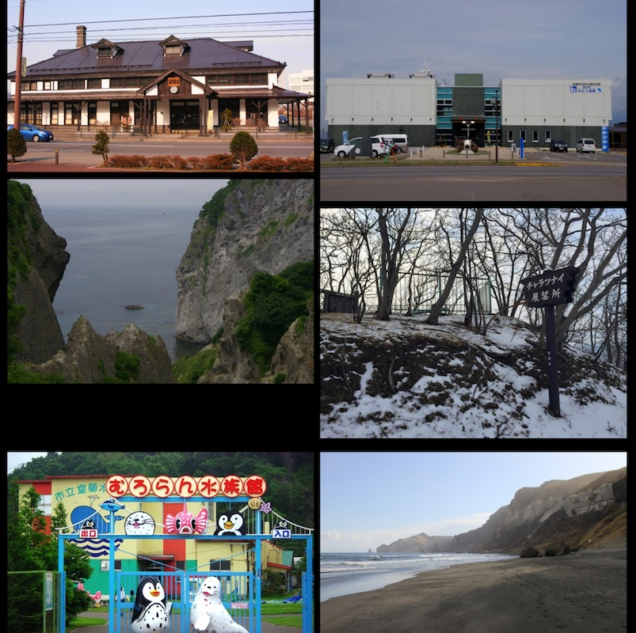

# dokophoto (写真からどこ行くの？)

写真ファーストのビジュアルなインターフェースを通じて、周辺の興味深いスポットを発見しましょう。dokophotoは現在地を利用して、地元の観光スポットや公共施設の写真を取得し、メイソンリー（masonry）グリッドで表示します。写真をタップすると、詳細の確認、地図上での表示、経路案内の取得ができます。

## デモ

**[ライブデモを試す](http://fukuno.jig.jp/1575)**

## 機能

-   **位置情報に基づくスポット発見:** 現在地を自動的に検出し、周辺の観光スポットを見つけます。
-   **ビジュアルな写真グリッド:** レスポンシブなマルチカラムの写真レイアウトでスポットを表示します。
-   **詳細情報ビュー:** 写真をタップするとオーバーレイが開き、場所の名前、説明、その他の利用可能なデータを確認できます。
-   **統合された地図:** 現在地と目的地の場所を示す静的マップを表示します。
-   **ワンタップ経路案内:** Googleマップへの直接リンクを提供し、ターンバイターン方式のナビゲーションを利用できます。
-   **オープンデータ活用:** 日本のオープンデータプラットフォーム（ODP）のLinked Open Dataを利用しています。

## 動作原理

アプリケーションは、ブラウザのGeolocation APIを通じてユーザーの座標を取得します。次に、地理的なバウンディングボックス内にある周辺のスポット（具体的には `TourSpot` および `CivicPOI` タイプ）を検索するためのGeoSPARQLクエリを構築します。このクエリはjig.jpのオープンデータプラットフォーム（ODP）のSPARQLエンドポイントに送信され、画像URLやメタデータを含む結果が写真グリッドに動的にレンダリングされます。

## 使い方

1.  ブラウザで[ウェブアプリケーション](http://fukuno.jig.jp/1575)を開きます。
2.  位置情報へのアクセスを求められたら、許可します。
3.  表示された写真を閲覧し、タップして詳細情報の確認や経路案内の取得を行います。

## 必要条件

本プロジェクトを利用するには、JavaScriptが有効になっており、Geolocation APIをサポートしているモダンWebブラウザが必要です。

## データ / API

本アプリケーションは、位置情報データと写真を取得するために[jig.jp オープンデータプラットフォーム（ODP）のSPARQLエンドポイント](https://sparql.odp.jig.jp/data/sparql)を使用しています。

## ライセンス

MIT License — 詳細は [LICENSE](LICENSE) を参照してください。
